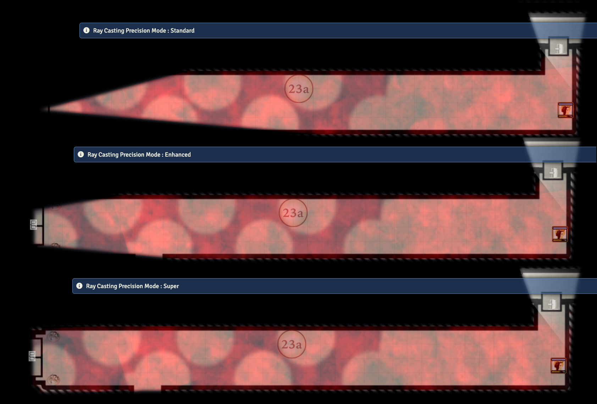

# Your Tokens Visible v2.7.2
*See what you need to see. No more, no less!*
***
A module for Foundry VTT.

By using **Your Tokens Visible** you enable the following features in your Foundry VTT:

1. "Push Tokens Back" - Float your cusor over foreground obstructing tokens, press a hot-key and send them to the back of rendering stack. This allows you to access the token you want, even when it's hidden beneath others.

This feature works on your own canvas so it will not alter the view of other players.
 
This feature is most useful in games where players may fight many enemies in close quarters and tokens crawl over each other, especially if tokens can share a single grid position,  preventing players or the GM from being able to see or manipulate the token they need.

The default hotkey is lowercase "z", but this can be reconfigured.

Note: This module replicates 100% of the functionality of the moduled called Push Tokens Back (which I also wrote). If you use 'Your Tokens Visible', you do not need PushTokensBack.

2. "Hidden Token Vision" - Activate this setting and when the GM turns off visibility for a Token, it will no longer lose vision. 

3. "Hidden Tokens Can Emit Light" - Hidden tokens are no longer prevented from emitting light.  

4. "Tokens Don't Fly" - Currently when the GM moves a token, and it's owner has Animated Token Movement enabled, they may see their token fly through walls and reveal the map along the movement path.  The GM may not have intended to reveal that path.  With this feature turned on, tokens that would cross a wall, will not use animated movement, but will simply  reappear at their destination without revealing the intermediary map.  Movement that intersects no barriers will use normal Animated Movement preferences.

5. Control Tools Color Assignment - assign alternate colours to your control tools' status buttons. This can help make them easier to see. 

6. Automatic Pan Mode - Players can now control whether the canvas will re-center or simply scroll the view when a token gets to close to the edge of the window. The margin for this feature can also be customized to each players preferences.

7. Enhanced and Super-Raycasting modes - improve the ray casting accuracy calculation used by Foundry to calculate dynamic vision and ambient lighting. This will enable tokens to reliably see the things that they SHOULD be seeing on the map, for instance a light source at the end of a narrow tunnel. (See RayCasting.png) Each player can toggle between modes, or set the default mode they wish to use.

**Standard Mode use default Foundry routine.

**Enhanced mode is approximately the same speed as standard but with improved sight-lines.

**Super mode is about 25% slower, but with even more improvement to sight-lines

8. Sight Calculations Cache - boost performance of Foundry on scenes with many walls, tokens or ambient light sources by preserving certain calculations that the base system repeats many times. (note: on Foundry 0.8.x most redundant calculations have been eliminated so turning this feature on or off makes little difference.)

9. Combat Tracker Initial Visibility - configure the initial visibility of new combatants based on hostile/neutral/friendly disposition. 

10. Token Movement Animation Speed - Allows GM to set the speed of token movement animation.  Increasing Token Movement Animation Speed makes the canvas feel snappier. Decreasing it makes token movement feel more delilberate and dramatic.

11. Token MultiVision - A setting to control how a player may have vision from multiple tokens simultaneously.  

12. Blind Tokens Controllable - The GM may not want players to know exactly where their blind or unconscious character is.  Standard Foundry Behavior lets players see and control their tokens even with no vision, however by disabling this setting blind tokens will no longer be controlled by players. Players with no vision source to the blind token will not see the token on the map; They will not be able to cycle to it or control it. Players will need to rely on the GM to move their blinded tokens.  

13. Misty Step - pressing Alt while moving a token will cause the token animation to be cancelled for that movement. This is useful for players to move a token, but to temporarily cancel animation as if teleporting.  

## COMPATIBILITY

For maximum compatibility with other modules use the following settings:

- Token Animate Speed : 10
- Token Multivision   : Limited
- Combat Tracker Initial Visibility : Use Standard Foundry Behavior
- Automatic Pan Mode : Recenter
- Automatic Pan Margin : 50
- Token Light : Hidden Tokens Never Radiate Light
- Hidden Token Vision : No
- Animation During GM Movement : Normal Token Animation
- Ray Casting Precision Mode : Standard
- Sight Calculations Cache : OFF
- Blind Tokens Controllable : YES

